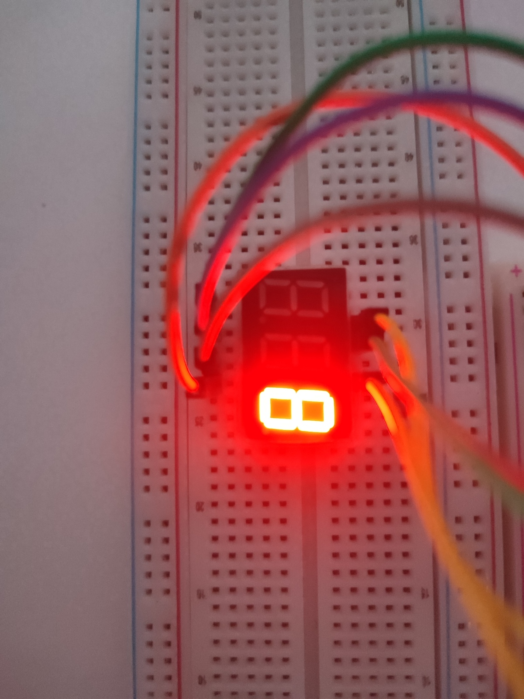
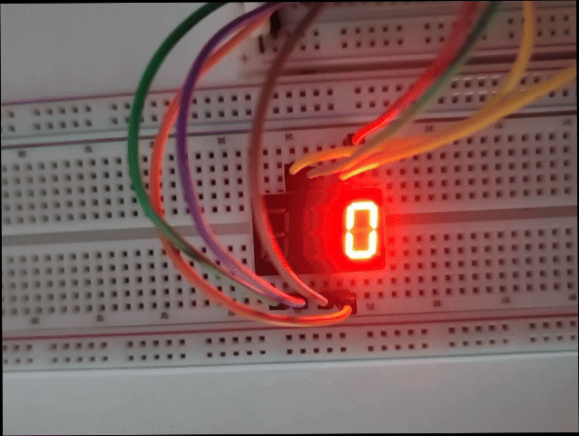
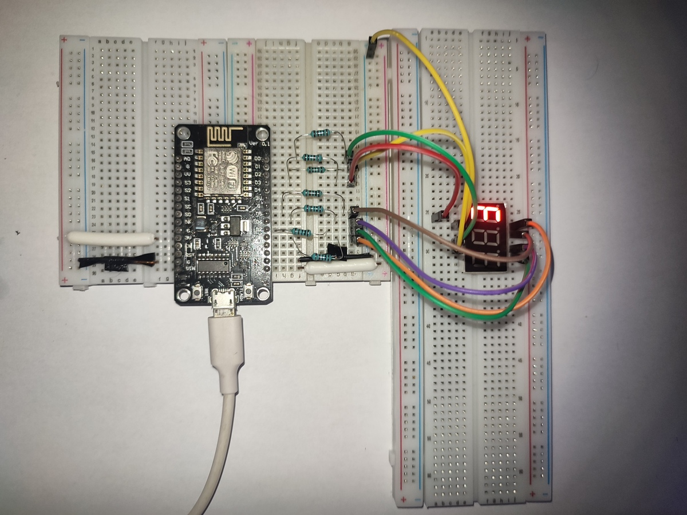

# ESP8266 7-Segment Counter

> 3631AS 1-digit 7-segment display counter (0-9) with ESP8266 — cycles every 1 second

---

## What It Does

Counts from 0 to 9 on a single 3631AS 7-segment display, changing every 1 second.  
Uses a lookup table to drive segments A-G through GPIO pins with 1kΩ current-limiting resistors.

---

## Hardware

| Component | Model | Qty | Notes |
|-----------|-------|-----|-------|
| Microcontroller | NodeMCU ESP8266 (ESP-12E) | 1 | |
| 7-Segment Display | 3631AS (Common Cathode) | 1 | 1-digit, 10-pin |
| Resistor | 1kΩ | 7 | Current limiting for segments A-G |
| Jumper wires | M-M | 15 | |

---

## Pin Mapping

| Display Pin | Segment | ESP8266 Pin | GPIO | Connection |
|-------------|---------|-------------|------|------------|
| 10 | A | D1 | GPIO5 | Via 1kΩ resistor |
| 6 | B | D3 | GPIO0 | Via 1kΩ resistor |
| 4 | C | D5 | GPIO14 | Via 1kΩ resistor |
| 2 | D | D6 | GPIO12 | Via 1kΩ resistor |
| 1 | E | D7 | GPIO13 | Via 1kΩ resistor |
| 9 | F | D0 | GPIO16 | Via 1kΩ resistor |
| 5 | G | D8 | GPIO15 | Via 1kΩ resistor |
| 7 | DIG3 (GND) | GND | — | Direct jumper wire |

> **Common Cathode:** DIG3 pin connects directly to GND. Segments light when GPIO goes HIGH.

---

## Visual Guide

### Breadboard Overview


### Display Close-up


### Demo


---

## Wiring Diagram


---

## Software

### PlatformIO Configuration

| Setting | Value |
|---------|-------|
| Platform | `espressif8266` |
| Board | `nodemcuv2` |
| Framework | `arduino` |

See [`platformio.ini`](platformio.ini) for full configuration.

### Build & Upload

1. Open project in VS Code with PlatformIO extension
2. Click **Build** (checkmark icon) or press `Ctrl+Alt+B`
3. Click **Upload** (arrow icon) or press `Ctrl+Alt+U`
4. The display should start counting 0→9 immediately

---

## How It Works

```cpp
// Lookup table: 1 = segment ON, 0 = segment OFF
const byte numPatterns[10][7] = {
  {1,1,1,1,1,1,0}, // 0
  {0,1,1,0,0,0,0}, // 1
  {1,1,0,1,1,0,1}, // 2
  // ... etc
};

void printNumber(int number) {
  digitalWrite(segA, numPatterns[number][0]);
  // ... drives all 7 segments
}
```

- **Period:** 1 second per digit
- **Cycle:** 0→9 takes 10 seconds, then repeats

---

## Files

| File | Description |
|------|-------------|
| [`src/main.cpp`](src/main.cpp) | Main source code |
| [`platformio.ini`](platformio.ini) | PlatformIO build configuration |
| `images/` | Project photos and demo GIF |
| `schematic/` | Wiring diagram |

---

## License

MIT — Use this as a template for your own projects.
